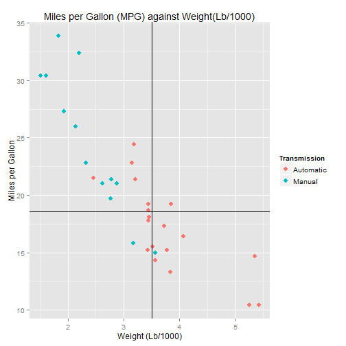

Shiny App to Predict MPG for Cars
========================================================
author: Tenchunky
date: 7th October 2015

'mtcars' Data Set
========================================================

The data was extracted from the 1974 Motor Trend US magazine, and comprises fuel consumption and 10 aspects of automobile design and performance for 32 automobiles (1973-74 models). In particular, the below variables are of interest:

- mpg: Miles/(US) gallon
- am: Transmission (0 = automatic, 1 = manual)
- wt: Weight (lb/1000)

Linear Regression
========================================================

A linear regression is performed for mpg ~ am + wt to allow us to use transmission type and vehicle weight to predict the fuel economy of vehicles. The predict function can then be used to predict the expected fuel economy in mpg.


```r
fit <- lm(mpg ~ am + wt, mtcars)
```


```

Call:
lm(formula = mpg ~ am + wt, data = mtcars)

Residuals:
    Min      1Q  Median      3Q     Max 
-4.5295 -2.3619 -0.1317  1.4025  6.8782 

Coefficients:
            Estimate Std. Error t value Pr(>|t|)    
(Intercept) 37.32155    3.05464  12.218 5.84e-13 ***
am1         -0.02362    1.54565  -0.015    0.988    
wt          -5.35281    0.78824  -6.791 1.87e-07 ***
---
Signif. codes:  0 '***' 0.001 '**' 0.01 '*' 0.05 '.' 0.1 ' ' 1

Residual standard error: 3.098 on 29 degrees of freedom
Multiple R-squared:  0.7528,	Adjusted R-squared:  0.7358 
F-statistic: 44.17 on 2 and 29 DF,  p-value: 1.579e-09
```

The model (mpg ~ am + wt) has a residual standard error of 3.098 on 29 degrees of freedom. It has an adjusted R-squared of 0.7528 which indicates that about 75% of variation is explained by the regression model. However, it should be noted that only weight (wt) is significant at 0.05 significance level.


Instructions
========================================================

This application predicts the miles per gallon (MPG) of the selected car based on its transmission type and weight by fitting a linear regression on the 1974 Motor Trend US magazine data. To begin:

1. Select the transmission type of the car to predict
2. Select the weight of the car to predict
3. Click on the submit button
4. View the results on the right


Prediction Results
========================================================
The inputs and the predicted mpg are indicated on the right main panel. From the plot, the selected weight (wt) is indicated as a vertical line and the predicted fuel economy (mpg) is indicated as a horizontal line.

 
